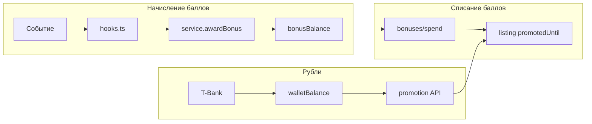

# Монетизация, кошелёк и продвижение — внутренняя документация

> Не для публичного сайта. Пользователь видит `/pricing`, `/profile/promotion`, `/profile/finance` (если есть), кабинет рекламы.

## 1. Два контура оплаты

| Контур | Валюта | Где хранится | Типичное использование |
|--------|--------|--------------|------------------------|
| Кошелёк | Рубли (копейки в БД как Int руб?) | `walletBalance` | Пополнение картой, BUMP/HIGHLIGHT/PIN за рубли |
| Баллы | Условные баллы | `bonusBalance` | См. [BONUS_POINTS.md](./BONUS_POINTS.md) |

Рубли и баллы **не смешиваются** в одной транзакции.

---

## 2. Кошелёк (рубли)

### API

- `GET/POST /api/wallet` — баланс, инициация пополнения через T-Bank.
- Webhook: `/api/payments/tbank/webhook` — зачисление после успешной оплаты.
- Редирект: `/payment/success?type=wallet`, `/payment/fail`.

### Модель

- `WalletTransaction` — история операций (пополнение, списание на услуги).
- `User.walletBalance` — текущий баланс.

### UI

- `/profile/promotion` — выбор услуги, оплата с кошелька или T-Bank.
- Старый путь `/wallet` может редиректить в кабинет (проверить `app/wallet/page.tsx`).

---

## 3. Платное продвижение объявлений

Логика: `src/app/api/profile/promotion/route.ts` (и связанные константы тарифов на странице promotion).

Услуги (рубли, ориентир — смотреть актуальные цены в коде страницы):

- **BUMP** — поднятие в ленте (`promotedUntil`, `isPromoted`)
- **HIGHLIGHT** — визуальное выделение (`highlightedUntil`)
- **PIN / TURBO** — расширенные пакеты (если включены в UI)

Списание с `walletBalance` + запись `WalletTransaction`.

За **баллы** — только `BUMP_1D` и `HIGHLIGHT_3D` через `/api/bonuses/spend` (дешевле по смыслу «мягкого» буста).

---

## 4. Честная выдача и реклама в ленте

### Органическая выдача

- `src/lib/listings/scoring/` — score объявлений.
- `promotionCapPercent` (28%) — не более доли promoted на странице.
- Mix ~30% рекламных слотов в сетке (см. `useFeedAds`, `MixedFeedGrid`).

### Рекламные кампании (AdCabinet)

- Модели: `AdCampaign`, показы, события — см. Prisma `AdCampaign`, `AdEvent`.
- Админка: `/admin/ads`.
- Вставка в ленту: `src/lib/ads/`, placements `HOME_RECOMMENDATIONS`, `MOBILE_FEED_INLINE`, и др.
- **Не путать** с бонусными баллами пользователя.

---

## 5. Реклама на сайте (медиа)

Публичная страница `/advertising` — заявки на размещение баннеров.

Отдельно: `SiteBanner` / admin banner manager — верхний баннер сайта.

---

## 6. Доверие и модерация (не деньги)

- `trustTier`, `user-trust-engine` — влияет на модерацию, лимиты, не на wallet/bonus.
- Значки `Badge` — витрина профиля, не начисление баллов.

---

## 7. Потоки данных (схема)

---

## 8. Что не показывать пользователю в маркетинге

- Внутренние caps 80/250 баллов (можно писать «есть лимиты» без цифр).
- Алгоритм score и cap 28% promoted.
- Детали webhook T-Bank и commission.

---

## 9. Связанные файлы

| Тема | Путь |
|------|------|
| Баллы | `docs/BONUS_POINTS.md` |
| SEO / индексация | `docs/SEO_ARCHITECTURE.md` |
| Деплой | `docs/DEPLOY_CHECKLIST.md` |
