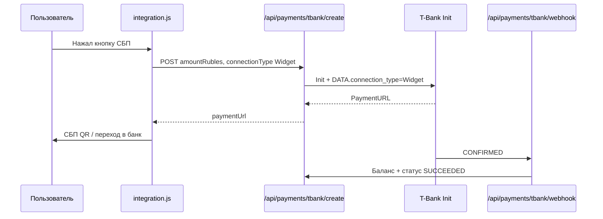

# T-Bank: СБП и кнопки быстрой оплаты

Официальные источники:

- [Способы интеграции](https://developer.tbank.ru/eacq/intro/connection) — обзор (редирект, iframe, **кнопки быстрой оплаты**)
- [Скрипт integration.js](https://developer.tbank.ru/eacq/intro/developer/setup_js/)
- [Кнопки быстрой оплаты (Speedpay)](https://developer.tbank.ru/eacq/intro/developer/setup_js/setup_speedpay)
- [Гайд по стилю T-Pay](https://acdn.t-static.ru/static/documents/TPay_guide_payment_method.pdf) — **только для кнопки T-Pay** (цвета, высота, QR); кнопку СБП рисует виджет банка

## Два способа принять оплату

| Способ | Когда использовать | СБП |
|--------|-------------------|-----|
| **Редирект** ([Init](https://developer.tbank.ru/eacq/api/init) → `PaymentURL`) | Карта, универсальная форма | На форме банка, не отдельная кнопка на сайте |
| **Виджет Speedpay** (`integration.js`) | Кнопки СБП / T-Pay / Mir Pay на своей странице | `updateWidgetTypes(['sbp'])` |

На Нашло: **виджет** на `/profile/finance`, **редирект** — запасная кнопка «Оплатить банковской картой».

---

## 1. Личный кабинет (обязательно)

### Терминал

- **Подключение:** Универсальное
- **HTTP-уведомления:** включить, URL: `https://nashlo.ru/api/payments/tbank/webhook`
- **Страницы:** `https://nashlo.ru/payment/success` и `.../payment/fail`

### Кнопки быстрой оплаты

[business.tbank.ru/oplata/main](https://business.tbank.ru/oplata/main) → **Магазины** → **Приём оплаты** → **Кнопки быстрой оплаты** → **Настроить** → включить **СБП** (и при необходимости T-Pay, Mir Pay).

Без этого в коде `updateWidgetTypes(['sbp'])` кнопка **не появится**, даже при правильном `terminalKey`.

---

## 2. Переменные окружения

```env
TBANK_TERMINAL_KEY=1777894900212
TBANK_PASSWORD=...
NEXT_PUBLIC_TBANK_TERMINAL_KEY=1777894900212
TBANK_NOTIFICATION_URL=https://nashlo.ru/api/payments/tbank/webhook
TBANK_SUCCESS_URL=https://nashlo.ru/payment/success
TBANK_FAIL_URL=https://nashlo.ru/payment/fail
```

`NEXT_PUBLIC_*` нужен только для виджета на фронте (тот же TerminalKey, не пароль).

---

## 3. Интеграция кнопки СБП (виджет)

По [setup_speedpay](https://developer.tbank.ru/eacq/intro/developer/setup_js/setup_speedpay):

### Шаг 1 — скрипт

```html
<script src="https://integrationjs.t-static.ru/integration.js" async></script>
```

В проекте: `src/components/payments/TbankQuickPay.tsx` подгружает его динамически.

### Шаг 2 — init

```js
PaymentIntegration.init({
  terminalKey: 'ВАШ_TERMINAL_KEY',
  product: 'eacq',
  features: { payment: {} },
})
```

### Шаг 3 — callback Init на бэкенде

При каждом нажатии на кнопку СБП/T-Pay:

1. Фронт вызывает **ваш** API (не Init напрямую с суммой с клиента).
2. Бэкенд вызывает `POST https://securepay.tinkoff.ru/v2/Init` с суммой из БД/правил.
3. В `DATA` обязательно: `connection_type: "Widget"`.
4. В callback возвращается `PaymentURL` из ответа Init.

В проекте: `POST /api/payments/tbank/create` → `src/app/api/payments/tbank/create/route.ts`.

### Шаг 4 — mount + типы кнопок

```js
const pay = await integration.payments.create('nashlo-quick-pay', {})
await pay.mount(document.getElementById('container'))
await pay.updateWidgetTypes(['sbp'])           // только СБП
// или ['sbp', 'tpay', 'mirpay']               // несколько способов
```

В проекте по умолчанию: `['sbp', 'tpay', 'mirpay']`. Только СБП:

```tsx
<TbankQuickPay widgetTypes={['sbp']} ... />
```

### Шаг 5 — setPaymentStartCallback

```js
await integration.payments.setPaymentStartCallback(async () => {
  const res = await fetch('/api/payments/tbank/create', { method: 'POST', ... })
  const data = await res.json()
  return data.paymentUrl  // PaymentURL для виджета
})
```

Виджет сам откроет сценарий СБП (QR / банк-приложение) по этой ссылке.

---

## 4. Стиль кнопок (гайд T-Pay PDF)

PDF [TPay_guide_payment_method.pdf](https://acdn.t-static.ru/static/documents/TPay_guide_payment_method.pdf) относится к **бренду T-Pay** («Оплатить с»):

- основной фон `#FFDD2D`, текст `#000` opacity 0.8;
- высота кнопки **Button L** — от **60px**, шрифт **18px**;
- нельзя менять логотип и произвольные цвета.

**Кнопка СБП** в виджете Speedpay отрисовывается **скриптом T-Bank** (официальный вид НСПК/СБП). Свою SVG-кнопку СБП вместо виджета делать не нужно — только `widgetTypes: ['sbp']`.

Со стороны сайта допустимо:

- контейнер на всю ширину;
- минимальная высота ряда кнопок **60px** (как в гайде для платёжных кнопок);
- не перекрывать iframe/overlay виджета своими слоями.

В `TbankQuickPay` контейнер: `min-h-[60px] w-full`.

Тему/язык виджета при необходимости меняют методами интеграции после mount (см. раздел «Настроить виджет» в setup_speedpay).

---

## 5. Схема потока (СБП)



---

## 6. Файлы в репозитории

| Файл | Назначение |
|------|------------|
| `src/components/payments/TbankQuickPay.tsx` | Виджет СБП/T-Pay |
| `src/app/profile/finance/page.tsx` | Страница пополнения |
| `src/app/api/payments/tbank/create/route.ts` | Init, `connection_type: Widget` |
| `src/app/api/payments/tbank/webhook/route.ts` | Статусы, зачисление |
| `src/lib/tbank-csp.ts` | CSP для доменов T-Bank |

---

## 7. Проверка

1. ЛК: СБП включён, webhook URL сохранён.
2. Prod: `NEXT_PUBLIC_TBANK_TERMINAL_KEY` задан, `pm2 restart otiva --update-env`.
3. `/profile/finance` → оферта → видна кнопка СБП.
4. Тестовый платёж → webhook → баланс обновился.

Минимум СБП по API T-Bank — **10 ₽**; в приложении для кошелька — **100 ₽**.
